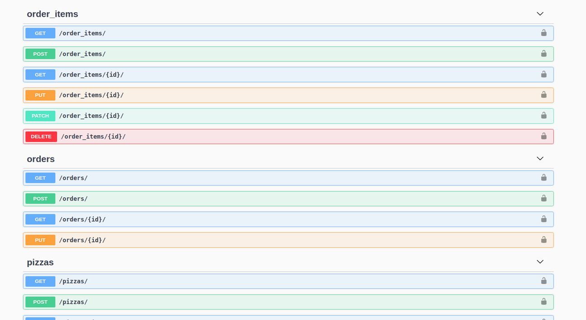

#### Description

Imagine a pizza ordering services with the following functionality:    

    * Only authenticated user can access apis.  
    • Order pizzas:
        * Only owner of the order can create it.
		• It should be possible to specify the desired flavors of pizza, the number of pizzas and their size.
		• An order should contain information regarding the customer.
		• It should be possible to track the status of delivery.
		• It should be possible to order the same flavor of pizza but with different sizes multiple times
	• Update an order:
	    * Only owner of the order can update it.
		• It should be possible to update the details — flavours, count, sizes — of an order
		• It should not be possible to update an order for some statutes of delivery (e.g. delivered).
		• It should be possible to change the status of delivery.
	• Cancel an order. Only owner of the order can cancel it.
	• Retrieve an order:
		• It should be possible to retrieve the order by its identifier. Only owner of the order can retrieve it.
	• List orders:
		• It should be possible to retrieve all the orders of an authenticated user at once.
		• Allow order filtering by status.

		
#### Setup  & Run  
* docker-compose up
* docker-compose exec web python manage.py createsuperuser 
      
#### Api Documentation  
*  I used OpenAPI Specification v2 which tells exactly what each api can do and also can execute the request.  
*  Enter to admin site.  
*  Check `http://127.0.0.1:8000/api_doc/`    

####  TODO  
* Need to write tests extensively.  
		

